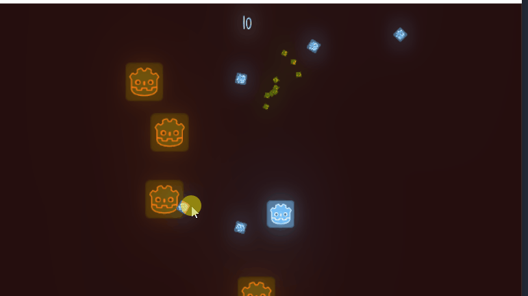

# Wave shooter
I started learning game making with Godot. so this is my first game.
I learned a lot from Parker Anderson's great tutorial. thank you!!

## project process
> 05.04-05.08

followed the tutorial >> [Play list](https://www.youtube.com/playlist?list=PL6bQeQE-ybqAYoaWz_ZEE2X4wX6PhwCWR)

this is the result of tutorial. and..

this is the my clone version. 
Yes. I JUST cloning, It's a lot harder and time consuming to understand the concept of this engine work. but still fun. cause It's so visual and interactive. 

but at this point I thought it's not good idea to keep making game. Because my bad python background. I decide to study python and then come back!

> 05.09-

Learning python studying data science. 
